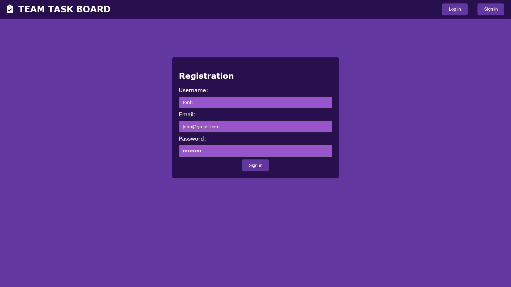
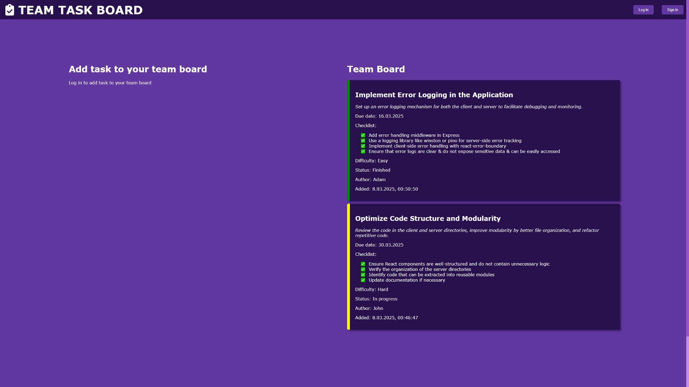
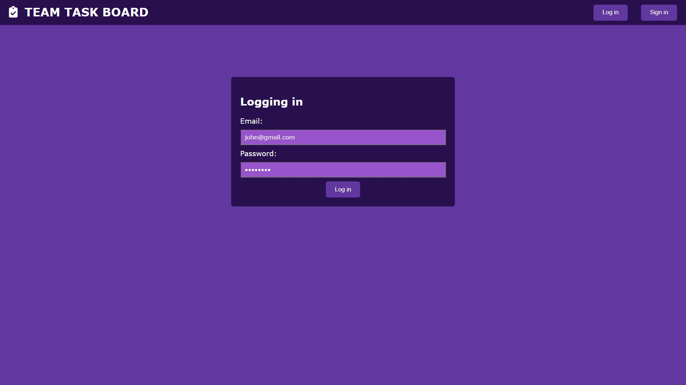
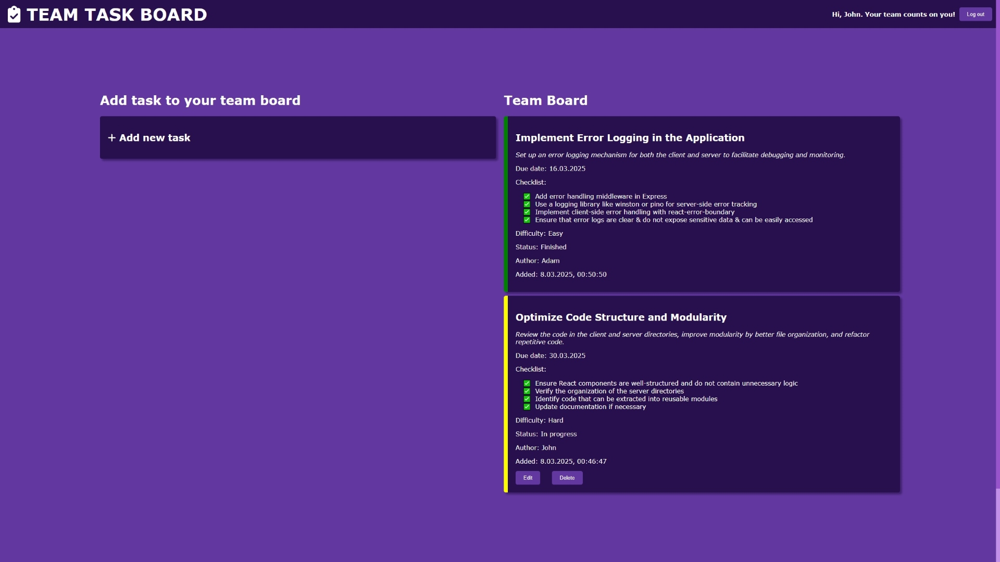
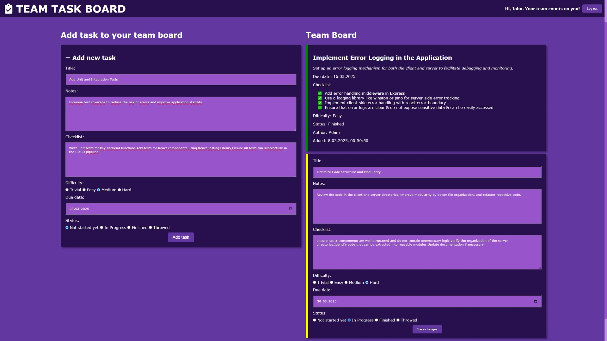

<p align="center"><h1 align="center">TEAM-TASK-BOARD</h1></p>
<p align="center">
	<em>Teamwork. Tasks. Done.
</em>
</p>
<p align="center">
	<!-- local repository, no metadata badges. --></p>
<p align="center">Built with the tools and technologies:</p>
<p align="center">
	
  
	
  
  
  
	
  
</p>
<br>

##  Table of Contents

- [ Overview](#overview)
- [ Features](#features)
- [ Project Structure](#project-structure)
  - [ Project Index](#project-index)
- [ Getting Started](#getting-started)
  - [ Prerequisites](#prerequisites)
  - [ Installation](#installation)
  - [ Usage](#usage)
- [ License](#license)

---

##  Overview

Team Task Board is a collaborative task management web application streamlining teamwork.  It features user authentication, task creation & editing, due date sorting, and a clean, intuitive interface.  Ideal for teams needing a simple, efficient way to manage projects and boost productivity.







---

##  Features

|      | Feature         | Summary                                                                                                                                                                                                                                                                                       |
| :--- | :---:           | :---                                                                                                                                                                                                                                                                                       |
| ⚙️  | **Architecture**  | Uses a client-server architecture with the MERN stack. The client is a React application, the server is a Node.js Express application, and the database is MongoDB. The `.env` file stores environment variables for the server.                                                                                             |
| 🔩 | **Code Quality**  | The codebase follows best practices for React projects on the client side and maintains a clean, well-structured, and modular codebase on the server side.                                                                                                |
| 🔌 | **Integrations**  | Uses `npm` for package management. The server integrates Mongoose for MongoDB connectivity and Express for building the API. The client integrates Axios for communication with the server's RESTful API.                                                                                                                                                          |
| 🧩 | **Modularity**    |  The project is structured with separate `client` and `server` directories, ensuring modularity. Inside the client directory, React components and modules follow recommended project structure best practices. Inside the server directory, the project is organized with appropriately named directories based on functionality, and key elements are exported as modules for reuse in different parts of the project.                                                                                                                          |                                                                                                                                   |
| 🛡️ | **Security**      | User authentication is handled via JWT in the server’s middleware. Passwords stored in the database are hashed for security.                                                                                                                          |
| 📦 | **Dependencies**  | Relies on `npm`, and various JavaScript packages (specified in `package.json` and `package-lock.json` files).  The `manifest.json` file contains metadata about the client application. The dependencies are managed using `npm`.                                                                                             |

---

##  Project Structure

```sh
└── team-task-board/
    ├── client
    │   ├── package-lock.json
    │   ├── package.json
    │   ├── public
    │   ├── README.md
    │   └── src
    ├── LICENSE
    ├── README.md
    └── server
        ├── .env
        ├── config
        ├── controllers
        ├── middlewares
        ├── models
        ├── package-lock.json
        ├── package.json
        ├── routes
        └── server.js
```


###  Project Index
<details open>
	<summary><b><code>TEAM-TASK-BOARD/</code></b></summary>
	<details> <!-- client Submodule -->
		<summary><b>client</b></summary>
		<blockquote>
			<table>
			<tr>
				<td><b><a href='./client\package-lock.json'>package-lock.json</a></b></td>
				<td>- The client\package-lock.json file is a dependency management file for the "client" portion of the project<br>- It specifies the exact versions of all client-side JavaScript packages used, ensuring consistent builds and preventing dependency conflicts<br>- This is crucial for maintaining the integrity and reproducibility of the client-side application within the larger project architecture.</td>
			</tr>
			<tr>
				<td><b><a href='./client\package.json'>package.json</a></b></td>
				<td>- package.json configures the React client application<br>- It specifies project dependencies, including React, testing libraries, and Axios for API calls, along with Font Awesome for icons and React Router for navigation<br>- The scripts section defines commands for development, building, and testing<br>- Browser compatibility settings ensure broad support<br>- The file manages the client-side application's environment and build process.</td>
			</tr>
			</table>
			<details>
				<summary><b>public</b></summary>
				<blockquote>
					<table>
					<tr>
						<td><b><a href='./client\public\index.html'>index.html</a></b></td>
						<td>- The index.html file serves as the main entry point for the React application, "Team Task Board"<br>- It provides the basic HTML structure, including metadata and links to necessary resources<br>- The <div id="root"> element acts as a container where the React application renders, dynamically populating the page with the interactive task board interface<br>- The file's purpose is to set up the initial page structure for the application's user interface.</td>
					</tr>
					<tr>
						<td><b><a href='./client\public\manifest.json'>manifest.json</a></b></td>
						<td>- The manifest.json file configures the web app's metadata for installation on a user's device<br>- It specifies application name, icons, startup behavior, and color themes<br>- This ensures a consistent and branded user experience across different platforms, enhancing the overall application presentation within the larger React application architecture.</td>
					</tr>
					<tr>
						<td><b><a href='./client\public\robots.txt'>robots.txt</a></b></td>
						<td>- robots.txt controls web crawler access to the client-side application<br>- It instructs all user agents to allow access to all pages, effectively making the entire site crawlable by search engines and other bots<br>- This ensures that the application's content is fully indexed and discoverable online<br>- The file's role is crucial for search engine optimization within the overall project architecture.</td>
					</tr>
					</table>
				</blockquote>
			</details>
			<details>
				<summary><b>src</b></summary>
				<blockquote>
					<table>
					<tr>
						<td><b><a href='./client\src\App.css'>App.css</a></b></td>
						<td>- App.css defines the global styling for the React application's user interface<br>- It sets the background color, font, and removes default margins and padding<br>- The stylesheet also customizes the appearance of the scrollbar, enhancing the visual appeal and user experience within the application's overall design<br>- This contributes to a consistent visual theme across the entire client-side application.</td>
					</tr>
					<tr>
						<td><b><a href='./client\src\App.js'>App.js</a></b></td>
						<td>- App.js serves as the main application component, routing users between the home, login, and registration pages<br>- It manages user authentication by checking for a stored token upon loading, setting the current user state accordingly<br>- A navigation bar, providing logout functionality, is rendered conditionally based on login status<br>- The component uses React Router for navigation and state management for user authentication.</td>
					</tr>
					<tr>
						<td><b><a href='./client\src\App.test.js'>App.test.js</a></b></td>
						<td>- App.test.js verifies a core component's rendering within the React application<br>- It confirms the presence of expected text, ensuring basic functionality and structural integrity of the application's primary component, App.js, during development<br>- This contributes to the overall quality assurance and testing strategy of the client-side codebase.</td>
					</tr>
					<tr>
						<td><b><a href='./client\src\index.css'>index.css</a></b></td>
						<td>- index.css establishes the global stylesheet for the React client application<br>- It sets default body styles, including font, margin, and anti-aliasing, and defines a monospace font for code elements<br>- This ensures consistent visual presentation across the entire user interface, contributing to a unified user experience.</td>
					</tr>
					<tr>
						<td><b><a href='./client\src\index.js'>index.js</a></b></td>
						<td>- The index.js file bootstraps the React application<br>- It renders the main application component, App, within a React StrictMode for enhanced development<br>- This file serves as the entry point for the client-side application, initiating the rendering process and integrating performance monitoring tools if enabled<br>- It connects the React application to the HTML document.</td>
					</tr>
					<tr>
						<td><b><a href='./client\src\reportWebVitals.js'>reportWebVitals.js</a></b></td>
						<td>- reportWebVitals.js measures and reports website performance metrics<br>- It uses the web-vitals library to collect key metrics like Cumulative Layout Shift (CLS), First Input Delay (FID), First Contentful Paint (FCP), Largest Contentful Paint (LCP), and Time to First Byte (TTFB)<br>- This data informs performance optimization efforts within the larger client-side application.</td>
					</tr>
					<tr>
						<td><b><a href='./client\src\setupTests.js'>setupTests.js</a></b></td>
						<td>- setupTests.js configures the testing environment for the React application's client-side code<br>- It integrates jest-dom, enhancing Jest's testing capabilities with DOM-specific assertions<br>- This improves the efficiency and readability of component tests within the larger project, enabling developers to easily verify UI elements and their interactions<br>- The setup streamlines testing throughout the client application.</td>
					</tr>
					</table>
					<details>
						<summary><b>components</b></summary>
						<blockquote>
							<details>
								<summary><b>Navbar</b></summary>
								<blockquote>
									<table>
									<tr>
										<td><b><a href='./client\src\components\Navbar\index.js'>index.js</a></b></td>
										<td>- The Navbar component renders a navigation bar, providing links to the application's home, login, and registration pages<br>- It dynamically displays a personalized greeting and logout button for logged-in users, enhancing user experience and managing authentication within the React-based task board application<br>- The component integrates with React Router for navigation and FontAwesome for icons.</td>
									</tr>
									<tr>
										<td><b><a href='./client\src\components\Navbar\styles.module.css'>styles.module.css</a></b></td>
										<td>- Styles define the navigation bar's appearance within the client-side application<br>- The CSS establishes a fixed, full-width navbar with a dark background,  positioning elements for branding and user actions<br>- Specific styles are applied to buttons, text, and icons, ensuring a consistent visual theme across the navigation component<br>- This contributes to the overall user interface design.</td>
									</tr>
									</table>
								</blockquote>
							</details>
							<details>
								<summary><b>TaskForm</b></summary>
								<blockquote>
									<table>
									<tr>
										<td><b><a href='./client\src\components\TaskForm\index.js'>index.js</a></b></td>
										<td>- TaskForm provides a user interface for creating and submitting new tasks<br>- It gathers task details including title, notes, checklist items, difficulty, due date, and status<br>- Upon submission, it sends a POST request to a backend API endpoint to persist the new task, leveraging local storage for authentication<br>- Successful submission triggers a page reload; errors are handled and displayed to the user<br>- The component integrates with FontAwesome for visual elements and uses a controlled form for data management.</td>
									</tr>
									<tr>
										<td><b><a href='./client\src\components\TaskForm\styles.module.css'>styles.module.css</a></b></td>
										<td>- Styles define the visual presentation of a task form within a React application<br>- The CSS module dictates the form's layout, using a card-style design with specific colors, shadows, and input field styling<br>- It ensures consistent visual appearance across the application, enhancing user experience by providing a visually appealing and user-friendly interface for task creation or modification.</td>
									</tr>
									</table>
								</blockquote>
							</details>
							<details>
								<summary><b>TaskItem</b></summary>
								<blockquote>
									<table>
									<tr>
										<td><b><a href='./client\src\components\TaskItem\index.js'>index.js</a></b></td>
										<td>- TaskItem renders individual task details within a larger task management application<br>- It displays task information and provides editing and deletion functionalities, conditional on user authorization<br>- The component dynamically updates the task's visual appearance based on its status, enhancing user experience and providing clear visual cues<br>- Data is managed locally within the component before updates are propagated to the application's backend.</td>
									</tr>
									<tr>
										<td><b><a href='./client\src\components\TaskItem\styles.module.css'>styles.module.css</a></b></td>
										<td>- Styles define the visual presentation of task items within a client-side application<br>- The CSS module dictates card layout, text styling, form arrangement, button centering, and list item formatting, contributing to a consistent user interface for task display and management within the broader application's component structure.</td>
									</tr>
									</table>
								</blockquote>
							</details>
							<details>
								<summary><b>TaskList</b></summary>
								<blockquote>
									<table>
									<tr>
										<td><b><a href='./client\src\components\TaskList\index.js'>index.js</a></b></td>
										<td>- TaskList component fetches and displays a user's tasks, sorted by due date, from a backend API<br>- It renders individual tasks using the TaskItem component, enabling deletion and editing functionalities<br>- These actions are performed via API calls, leveraging authentication tokens for secure access<br>- The component updates the displayed task list after successful API interactions.</td>
									</tr>
									</table>
								</blockquote>
							</details>
						</blockquote>
					</details>
					<details>
						<summary><b>pages</b></summary>
						<blockquote>
							<details>
								<summary><b>HomePage</b></summary>
								<blockquote>
									<table>
									<tr>
										<td><b><a href='./client\src\pages\HomePage\index.js'>index.js</a></b></td>
										<td>- HomePage renders the main application interface<br>- It displays a task form for adding new tasks, conditionally shown based on user login status<br>- A task list component presents existing tasks<br>- The page uses styled components for visual layout, integrating seamlessly with the TaskList and TaskForm components to provide a user-friendly task management experience.</td>
									</tr>
									<tr>
										<td><b><a href='./client\src\pages\HomePage\styles.module.css'>styles.module.css</a></b></td>
										<td>- Styles define the layout of the homepage within the client-side application<br>- The CSS dictates a responsive design, centering content and arranging elements in columns for larger screens, transitioning to a single column layout on smaller screens<br>- It ensures consistent visual presentation across different devices by managing margins and flexbox properties for optimal user experience<br>- This contributes to the overall user interface of the application's homepage.</td>
									</tr>
									</table>
								</blockquote>
							</details>
							<details>
								<summary><b>LoginPage</b></summary>
								<blockquote>
									<table>
									<tr>
										<td><b><a href='./client\src\pages\LoginPage\index.js'>index.js</a></b></td>
										<td>- LoginPage handles user authentication within the client-side application<br>- It presents a login form, collects user credentials, and submits them to a backend server for verification<br>- Upon successful authentication, it stores a token locally and redirects the user to the application's home page<br>- Error handling is included to manage failed login attempts.</td>
									</tr>
									<tr>
										<td><b><a href='./client\src\pages\LoginPage\styles.module.css'>styles.module.css</a></b></td>
										<td>- Styles define the visual presentation of the login page within a larger web application<br>- The CSS dictates the vertical spacing, central alignment of form elements, card styling (dimensions, background, padding), and button placement<br>- These styles contribute to the user interface's overall look and feel, enhancing user experience during login.</td>
									</tr>
									</table>
								</blockquote>
							</details>
							<details>
								<summary><b>RegisterPage</b></summary>
								<blockquote>
									<table>
									<tr>
										<td><b><a href='./client\src\pages\RegisterPage\index.js'>index.js</a></b></td>
										<td>- RegisterPage handles new user registration<br>- It presents a form for collecting user credentials (name, email, password), submits this data to a backend server via an API call, and redirects to the login page upon successful registration<br>- Error handling is included to manage failed registration attempts, providing feedback to the user<br>- The component uses React and Axios for frontend functionality.</td>
									</tr>
									<tr>
										<td><b><a href='./client\src\pages\RegisterPage\styles.module.css'>styles.module.css</a></b></td>
										<td>- Styles define the visual layout of the registration page within a larger web application<br>- The CSS dictates page element positioning, using vertical margins and flexbox for centering form elements within a dark-colored card<br>- It ensures consistent visual presentation across different screen sizes, enhancing user experience during account creation.</td>
									</tr>
									</table>
								</blockquote>
							</details>
						</blockquote>
					</details>
				</blockquote>
			</details>
		</blockquote>
	</details>
	<details> <!-- server Submodule -->
		<summary><b>server</b></summary>
		<blockquote>
			<table>
			<tr>
				<td><b><a href='./server\.env'>.env</a></b></td>
				<td>- The .env file configures the application's environment settings<br>- It specifies the server port (5555), the MongoDB connection string (mongodb://127.0.0.1/team_task_board), and a JWT secret for authentication<br>- These settings are crucial for the application's runtime, enabling database connectivity and secure user authorization within the larger team task board application.</td>
			</tr>
			<tr>
				<td><b><a href='./server\package-lock.json'>package-lock.json</a></b></td>
				<td>- The server/package-lock.json file is a dependency management file for the server component of the project<br>- It specifies the exact versions of all required Node.js packages (like Express.js, bcryptjs, and jsonwebtoken), ensuring consistent and reproducible builds across different environments<br>- This is crucial for maintaining the integrity and functionality of the server application within the larger project architecture.</td>
			</tr>
			<tr>
				<td><b><a href='./server\package.json'>package.json</a></b></td>
				<td>- The package.json file configures the server application<br>- It specifies project metadata, defines scripts for starting the server using Nodemon, and lists dependencies including Express for routing, Mongoose for database interaction, and libraries for security and JSON web tokens<br>- Essentially, it acts as the server's manifest, managing its environment and dependencies.</td>
			</tr>
			<tr>
				<td><b><a href='./server\server.js'>server.js</a></b></td>
				<td>- The server.js file acts as the main application server<br>- It initializes the Express.js application, connects to a database, enables CORS, and defines routes for task and user management via imported modules<br>- Essentially, it sets up and runs the backend API, handling requests and responses for the entire application<br>- The server listens on a specified port for incoming requests.</td>
			</tr>
			</table>
			<details>
				<summary><b>config</b></summary>
				<blockquote>
					<table>
					<tr>
						<td><b><a href='./server\config\db.js'>db.js</a></b></td>
						<td>- The db.js file establishes the database connection for the application<br>- It uses Mongoose to connect to a MongoDB instance, whose URI is retrieved from environment variables<br>- Successful connection logs a confirmation message; failure results in an error message and application termination<br>- This ensures the application can only operate with a functional database connection, forming a crucial part of the server's initialization.</td>
					</tr>
					</table>
				</blockquote>
			</details>
			<details>
				<summary><b>controllers</b></summary>
				<blockquote>
					<table>
					<tr>
						<td><b><a href='./server\controllers\taskController.js'>taskController.js</a></b></td>
						<td>- The taskController.js file manages all HTTP requests related to tasks within a task management application<br>- It handles creating, retrieving, updating, and deleting tasks, ensuring data integrity and providing appropriate HTTP responses<br>- The controller interacts with a Task model and a User model to manage task data and author information, enforcing data validation before saving new tasks.</td>
					</tr>
					<tr>
						<td><b><a href='./server\controllers\userController.js'>userController.js</a></b></td>
						<td>- The userController.js file manages user authentication within the application<br>- It handles user registration, securely hashing passwords before storage, and user login, verifying provided credentials against stored hashes<br>- Upon successful authentication, it issues JSON Web Tokens (JWTs) for subsequent secured access<br>- Error handling is implemented to manage invalid inputs and database issues.</td>
					</tr>
					</table>
				</blockquote>
			</details>
			<details>
				<summary><b>middlewares</b></summary>
				<blockquote>
					<table>
					<tr>
						<td><b><a href='./server\middlewares\authMiddleware.js'>authMiddleware.js</a></b></td>
						<td>- AuthMiddleware verifies user authentication for protected routes<br>- It intercepts requests, extracts JWTs from authorization headers, and validates them using a secret key<br>- Upon successful verification, it attaches the user ID to the request object for subsequent middleware or route handlers<br>- Invalid tokens result in unauthorized access responses<br>- This ensures secure access control within the application's server-side architecture.</td>
					</tr>
					</table>
				</blockquote>
			</details>
			<details>
				<summary><b>models</b></summary>
				<blockquote>
					<table>
					<tr>
						<td><b><a href='./server\models\Task.js'>Task.js</a></b></td>
						<td>- Task.js defines the Mongoose schema for tasks within the application's database<br>- It structures task data, including title, author, notes, checklist, difficulty, due date, and status<br>- This schema facilitates database interaction and data management for tasks, serving as a crucial component of the server-side model layer.</td>
					</tr>
					<tr>
						<td><b><a href='./server\models\User.js'>User.js</a></b></td>
						<td>- The User.js model defines the structure for user data within the application's database<br>- It utilizes Mongoose to create a schema specifying user attributes like name, email, password, and creation timestamp<br>- This schema facilitates user account management and persistence, serving as a crucial component of the application's authentication and user data storage.</td>
					</tr>
					</table>
				</blockquote>
			</details>
			<details>
				<summary><b>routes</b></summary>
				<blockquote>
					<table>
					<tr>
						<td><b><a href='./server\routes\taskRoutes.js'>taskRoutes.js</a></b></td>
						<td>- taskRoutes.js defines RESTful API endpoints for managing tasks<br>- It leverages Express.js to handle HTTP requests, routing them to corresponding controller functions for retrieving, creating, updating, and deleting tasks<br>- Authentication middleware protects create, update, and delete operations, ensuring only authorized users can modify task data<br>- The module exports the configured router for integration into the main application server.</td>
					</tr>
					<tr>
						<td><b><a href='./server\routes\userRoutes.js'>userRoutes.js</a></b></td>
						<td>- User authentication functionality is provided via these routes<br>- It defines Express.js routes for user registration and login, leveraging controller functions to handle the respective processes<br>- These routes are integral to the server's overall architecture, enabling user access and session management within the application<br>- The controllers, located in ../controllers/userController, contain the business logic for user creation and verification.</td>
					</tr>
					</table>
				</blockquote>
			</details>
		</blockquote>
	</details>
</details>

---
##  Getting Started

###  Prerequisites

Before getting started with team-task-board, ensure your runtime environment meets the following requirements:

- **Programming Language:** JavaScript runtime - Node.js
- **Database:** MongoDB
- **Package Manager:** Npm

###  Installation

Install team-task-board using the following method:

1. Clone the team-task-board repository:
```sh
git clone https://github.com/Eyelor/team-task-board
```

2. Navigate to the project directory:
```sh
cd team-task-board
```

3. Navigate to the server directory:
```sh
cd server
```

4. Install the server project dependencies:

**Using `npm`**

```sh
npm install
npm install nodemon
```

5. Navigate to the client directory:
```sh
cd ../client
```

6. Install the client project dependencies:

**Using `npm`**

```sh
npm install
```

###  Usage
Run team-task-board using the following method:

1. Make sure that MongoDB database is up and running

2. Navigate to the project directory:
```sh
cd team-task-board
```

3. Navigate to the server directory:
```sh
cd server
```

4. Run the server app:

**Using `npm`**

```sh
npm start
```

5. Navigate to the client directory in a new terminal:
```sh
cd team-task-board/client
```

6. Run the client app:

**Using `npm`**

```sh
npm start
```

---

##  License

This project is protected under the Apache 2.0 License. For more details, refer to the [LICENSE](./LICENSE) file.

---
